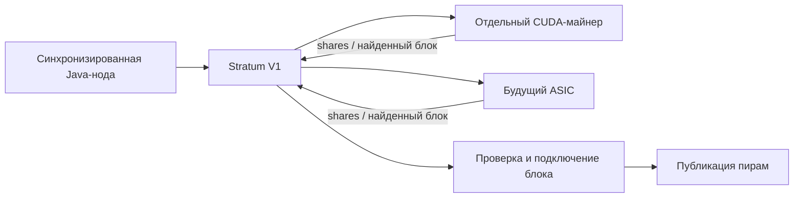

# Проверка готовности к GPU-майнингу и последующему ASIC

Проверка 2026-10-07. Исходное предположение: собственный solo-майнинг Bitcoin,
первичная отладка в regtest, затем выбранная публичная сеть. Работа через внешний
пул имеет другой путь: GPU-клиент подключается к пулу, локальная нода не выдаёт
ему задания и не ведёт выплаты пула.

## Вывод

Нода уже имеет серверную часть майнинга: создание шаблона, Stratum V1, проверку
shares, подключение и публикацию найденного блока. CUDA-майнера в проекте нет.
Включение Stratum или запуск ноды сами по себе не запускают поиск nonce на GPU.
NonceMiner — ограниченный CPU-перебор, используемый тестами.

Рабочий путь для GPU и ASIC:



Разделение позволяет сохранить сервер и консенсусный код при замене GPU на ASIC.
Протокольный путь соответствует [схеме Bitcoin mining](https://developer.bitcoin.org/devguide/mining.html).
CUDA-майнер может быть отдельным C++/CUDA приложением; JNI внутри JVM не является
необходимым условием. Код консенсуса и UTXO-обработки остаётся на ноде.

## Что проверено на компьютере

| Компонент | Результат |
| --- | --- |
| GPU | NVIDIA GeForce RTX 4070, 12282 MiB |
| Compute capability | 8.9, получено через nvidia-smi |
| Драйвер | 610.88 |
| CUDA Toolkit / nvcc | 12.2 / V12.2.128 |
| Найденный MSVC | Visual Studio 18 Community, toolset 14.50.35717 |
| Минимальная CUDA-компиляция | Не проходит: unsupported Microsoft Visual Studio version |

CUDA 12.2 поддерживает `sm_89`, но установленный host compiler несовместим с ним.
Проверено не только по документации: компиляция минимального kernel остановилась
на `include/crt/host_config.h:164`. Этот файл допускает `_MSC_VER < 1940`,
тогда как найденный toolset относится к более новой версии.

Нужен поддерживаемый CUDA 12.2 компилятор, например MSVC 193x, либо согласованное
обновление всей связки CUDA/host compiler. Один только свежий драйвер не исправляет
совместимость nvcc и MSVC. Официальные таблицы:
[Windows compiler support CUDA 12.2](https://docs.nvidia.com/cuda/archive/12.2.0/cuda-installation-guide-microsoft-windows/index.html),
[nvcc: sm_89](https://docs.nvidia.com/cuda/archive/12.2.2/cuda-compiler-driver-nvcc/index.html).
Флаг обхода проверки компилятора не подтверждает корректность сборки.

Артефакты: `target/ibd-core-policy/cuda-readiness-probe.cu` и
`cuda-readiness-probe.log`. Kernel не запускался; SHA256d-хешрейт не измерен.

## Готовые компоненты и ограничения

| Участок | Состояние |
| --- | --- |
| Шаблон блока | MiningController / NodeValidationService, GBT и coinbase/witness |
| Отправка решения | Проверка NodeValidationService и публикация NodeRelayService |
| Stratum V1 | Subscribe, authorize, submit, notify, extranonce, version rolling |
| Shares | SHA256d, полный target, проверка времени, повторов и актуальности |
| Vardiff | Реализован, по умолчанию выключен |
| GPU-поиск | Не реализован; CUDA/JNI/OpenCL backend в исходниках не найден |
| ASIC | Серверная основа есть; совместимость с реальным устройством не проверена |
| Пул с выплатами за shares | Не реализован: сервер работает в solo-режиме |
| Метрики | StratumServer.statistics() есть; отдельного HTTP endpoint нет |

Код: `mining/.../NonceMiner.java`, `app/.../config/StratumConfiguration.java`,
`app/.../service/StratumMiningBackend.java`, `stratum/.../StratumSession.java`,
`stratum/.../share/ShareValidator.java`.

## Обязательные настройки до реального майнинга

1. **Адрес награды.** В application.yml стоит резервный `payout-script: "51"`.
   Это OP_TRUE, а не выход, защищённый ключом твоего кошелька. Для публичной сети
   требуется собственный payout-address или проверенный scriptPubKey. Mainnet
   принимает `bc1...`, testnet — `tb1...`; проверку соответствия сети сохранять.
   Дополнительная защита перед эксплуатацией: запретить OP_TRUE в Stratum для
   публичных сетей. При этом обычная синхронизация и regtest должны оставаться
   доступны без настройки реальных выплат.
2. **Профиль сети.** Текущая конфигурация IntelliJ явно выбирает testnet и
   переопределяет payout-address через BITCOIN_TESTNET_MINING_PAYOUT_ADDRESS.
   Для mainnet нужен отдельный запуск с mainnet-профилем и mainnet-адресом;
   testnet-параметр выплат в него переносить нельзя. Публичная testnet не даёт
   mainnet BTC. Для первичной проверки GPU лучше использовать regtest.
3. **Готовность цепочки.** Stratum не выдаёт work до isMiningReady(): RUNNING,
   завершённый IBD, готовые пиры, актуальная проверка live sync и совпадение tip с
   best header. Backend дополнительно проверяет возраст tip для публичных сетей.
   Во время текущей проверки RPC 127.0.0.1:18336 недоступен, поэтому фактическая
   готовность работающей ноды не подтверждена. Ранее измеренная скорость IBD сама
   по себе не означает готовность к майнингу.
4. **Включение Stratum.** Сейчас `bitcoin.stratum.enabled` не задан, сервер
   выключен. Для локального GPU нужны enabled=true, bind=127.0.0.1, port=3333,
   user и непустой password. Для ASIC на другой машине — LAN bind и доступ к
   этому порту. RPC для Stratum не обязателен. Пароль RPC по умолчанию `bitcoin`;
   для рабочего запуска его нужно заменить. Stratum V1 здесь без TLS.
5. **Сложность shares.** Значение по умолчанию 65536 рассчитано на значительно
   больший хешрейт, чем типичный первый GPU-клиент. Для отладки начать с низкой
   сложности и включить vardiff; затем подобрать её по измеренному SHA256d H/s.

Пример настройки серверной части для первоначального GPU-клиента, после задания
собственного адреса выплат:

```yaml
bitcoin:
  stratum:
    enabled: true
    bind: 127.0.0.1
    port: 3333
    user: miner
    password: ${BITCOIN_STRATUM_PASSWORD}
    difficulty: 1
    vardiff:
      enabled: true
      minimum: 0.001
      maximum: 1000000
      target-seconds: 15
      retarget-seconds: 60
```

Это пример параметров, не автоматически активированный профиль. GPU-клиент
подключается к `stratum+tcp://127.0.0.1:3333`, например как `miner.gpu01`.
Сервер возвращает false на mining.suggest_difficulty; клиент не должен считать,
что это сообщение изменило начальную сложность.

Ожидаемый интервал между shares приблизительно равен `D * 2^32 / H` секунд,
где D — сложность shares, H — измеренные SHA256d-хеши в секунду. Например, для
**условного** 1 GH/s сложность 1 даёт около 4.3 с, а 65536 — около 3.26 суток.
Это арифметический пример, не замер RTX 4070. Vardiff влияет на shares, но не
снижает сетевую сложность и не повышает шанс найти настоящий блок.

## Что добавить для CUDA-клиента

Первый рабочий клиент должен выполнять весь цикл, а не только benchmark хеша:

- TCP Stratum subscribe/authorize и обработка notify/set_difficulty;
- получение extranonce1 и размера extranonce2 от сервера, сборка coinbase,
  Merkle root и строго 80-байтного заголовка;
- CUDA SHA256d с переиспользованием midstate первого 64-байтного блока;
- непересекающиеся uint32 nonce-диапазоны, полный поиск с корректным переполнением,
  обновление extranonce2 после исчерпания диапазона;
- точное преобразование target и порядка байтов, включающее сравнение полного
  256-битного хеша; network target и share target должны различаться;
- короткие пакеты GPU-работы и отмена старого job при clean_jobs/смене родителя;
- CPU-перепроверка найденных GPU-кандидатов, mining.submit и обработка отказов;
- reconnect, корректное обновление времени с учётом разрешённого time rolling,
  явная обработка ошибок CUDA и прекращение неактуальной работы;
- реальные H/s, принятые/rejected/stale shares, время смены задания и состояние GPU.

Проверка перед mainnet: совпадение CUDA SHA256d с Java на известных заголовках,
пограничных nonce/target и случайных данных; поиск полного regtest-блока GPU;
прохождение Stratum, локальной валидации и приёма этого блока изолированным Core.
Совместимость драйвера или успешный deviceQuery не заменяют эту проверку.

## Что подготовить для ASIC

Сохранить Stratum-контур и добавить профиль начальной сложности для ASIC.
Один низкий GPU initial difficulty не подходит мощному ASIC: vardiff меняется
только раз в окно и максимум в четыре раза за шаг, а сервер ограничивает входящий
поток 100 запросами/сек. Для совместной работы нужен выбор initial difficulty
по worker/device либо отдельные Stratum endpoints с общей backend-логикой.
Сейчас конфигурация создаёт один сервер с одним стартовым difficulty.

Перед подключением конкретного устройства проверить extranonce1/2, version
rolling, порядок байтов, смену clean_jobs, reconnect и принятие shares его
прошивкой. Реальная работа ASIC в тестах пока не подтверждена.

## Результаты тестов и эксплуатационная граница

`target/ibd-core-policy/gpu-mining-readiness-tests.log`: BUILD SUCCESS, 24 теста,
ноль failures/errors, один пропуск opt-in throughput benchmark. Выполнены CPU
nonce search, jobs, vardiff, version rolling, payout resolver, HTTP mining RPC,
настоящий TCP Stratum-клиент и два теста с установленным бинарником Bitcoin Core.
Тестовый процесс очищал только свою унаследованную переменную mainnet payout.
Никакая публичная база не перемещалась и не изменялась этой проверкой.

Эти проверки подтверждают серверный контур. Они не подтверждают CUDA-клиент,
mainnet consensus parity, длительную нагрузку или совместимость реального ASIC.
GPU я рекомендую использовать прежде всего для разработки и проверки контура:
Bitcoin mainnet ориентирован на специализированное оборудование, а shares solo
сервера сами по себе не оплачиваются. Оценивать время до блока нужно по сетевой
сложности и измеренному SHA256d-хешрейту, а не по числу CUDA cores или игровым FPS.
См. [Bitcoin FAQ: mining](https://bitcoin.org/en/faq#what-do-i-need-to-start-mining).
